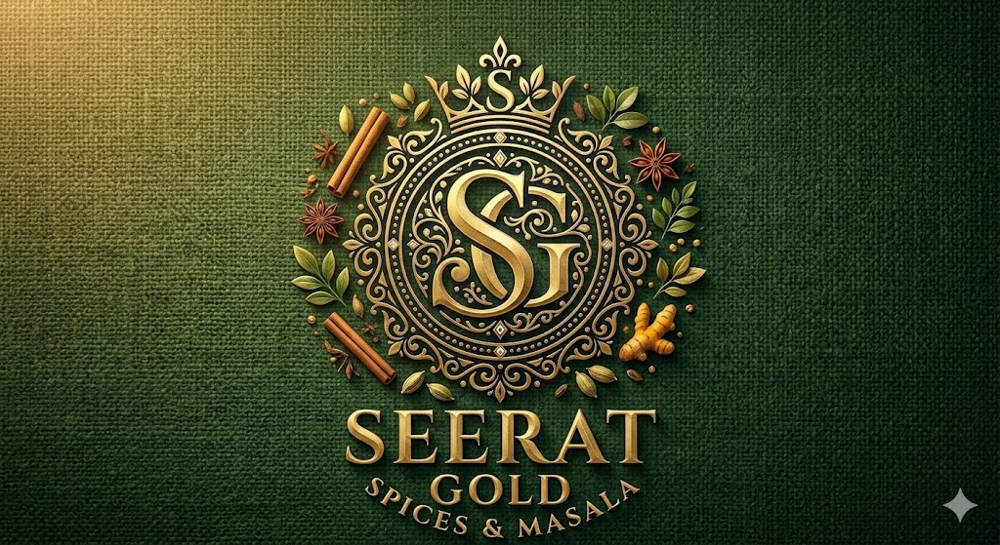

<div align="center">
  

  # 🌟 Seerat Gold
  **Pure by Origin. Rich by Nature.**

  <p>
    Premium quality spices sourced directly from native growing regions. <br/>
    Experience the authentic taste of India with Seerat Gold.
  </p>

  [](https://reactjs.org/)
  [](https://vitejs.dev/)
  [](https://tailwindcss.com/)
  [](https://www.framer.com/motion/)
</div>

<br />

## 📖 Our Story
At **Seerat Gold**, we believe that the secret to an unforgettable meal lies in the purity of its ingredients. We source our raw spices directly from their native regions — where they grow naturally and develop their most authentic, robust flavors.

Every pinch of our spice is meticulously cleaned, expertly processed, and hygienically sealed to ensure that it reaches your kitchen exactly as nature intended.

## ✨ Key Features
- **Immersive Premium Design:** A highly polished, modern web experience crafted with custom Tailwind CSS utility tokens and stunning micro-animations using Framer Motion.
- **Interactive Story Journey:** An auto-playing horizontal carousel that walks customers through our 5-stage process from sourcing to the kitchen.
- **Curated Combos & Offers:** Dedicated sections highlighting our hand-picked spice combinations like the *Everyday Essentials Combo* and *Punjabi Combo*.
- **Direct WhatsApp Integration:** Seamlessly connects customers to our business WhatsApp to place orders, inquire about bulk pricing, or get quick recommendations.
- **Fully Responsive Structure:** Perfectly optimized and adaptive layout for mobile, tablet, and widescreen desktop viewing.

## 🛠️ Technology Stack
The project is organized in a monorepo-style structure:
- **Frontend (`/client`):** React, Vite, Tailwind CSS, Framer Motion, Lucide React (for iconography), React Router DOM.
- **Backend (`/server`):** Node.js and Express architecture (prepared for API expansion and database integration).

## 🚀 Getting Started

### Prerequisites
Make sure you have [Node.js](https://nodejs.org/) installed on your local machine.

### Installation & Running

1. **Clone the repository:**
   ```bash
   git clone https://github.com/Ashi12218604/SeeratGold.git
   cd SeeratGold
   ```

2. **Install Frontend Dependencies:**
   ```bash
   cd client
   npm install
   ```

3. **Start the Development Server:**
   ```bash
   npm run dev
   ```


---
<div align="center">
  <i>Bringing families together over flavorful meals.</i>
</div>
